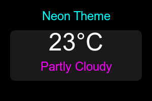
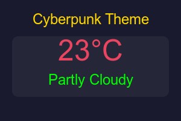
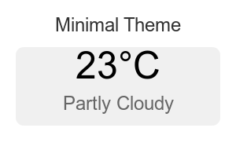
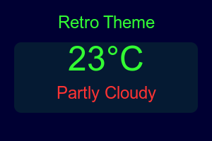
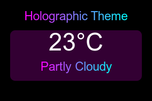

# Weather Nexus: Futuristic Weather Dashboard

Weather Nexus is a cutting-edge weather dashboard that provides real-time weather information and forecasts with a futuristic aesthetic. This web application offers an immersive user experience with customizable themes, interactive charts, and detailed weather metrics.

## Features

### 1. Current Weather Conditions
Get up-to-date information on temperature, weather description, and key metrics for your selected location.

### 2. 7-Day Forecast
Plan ahead with our detailed 7-day forecast, showing temperature ranges and weather conditions for the upcoming week.

### 3. Interactive Weather Trends Chart
Visualize temperature, precipitation, and wind speed trends over time with our interactive chart.

### 4. Advanced Metrics
Access detailed weather information including UV index, pressure, "feels like" temperature, visibility, and cloud cover.

### 5. Customizable Themes
Choose from a variety of futuristic themes to personalize your weather-viewing experience:
- Neon
- Cyberpunk
- Minimal
- Retro
- Holographic

## Themes

### Neon Theme


### Cyberpunk Theme


### Minimal Theme


### Retro Theme


### Holographic Theme


### 6. Location Selection
Get weather information for various cities around the world or use your current location.

### 7. Unit Toggle
Switch between metric (°C, km/h) and imperial (°F, mph) units with ease.

## Installation

1. Clone the repository:
   ```
   git clone https://github.com/yourusername/weather-nexus.git
   ```
2. Navigate to the project directory:
   ```
   cd weather-nexus
   ```
3. Open `index.html` in your preferred web browser.

## Usage

1. Select your desired theme from the dropdown menu.
2. Choose a city or use your current location.
3. Toggle between metric and imperial units as needed.
4. Explore the various panels for current conditions, forecast, trends, and advanced metrics.
5. Click on a day in the 7-day forecast to view more detailed information.

## Technologies Used

- HTML5
- CSS3
- JavaScript
- Chart.js for data visualization
- Moment.js for date/time manipulation
- Open-Meteo API for weather data

## Contributing

We welcome contributions to Weather Nexus! Please follow these steps to contribute:

1. Fork the repository
2. Create a new branch (`git checkout -b feature/AmazingFeature`)
3. Commit your changes (`git commit -m 'Add some AmazingFeature'`)
4. Push to the branch (`git push origin feature/AmazingFeature`)
5. Open a Pull Request

## License

This project is licensed under the MIT License - see the [LICENSE.md](LICENSE.md) file for details.

## Acknowledgments

- Weather data provided by [Open-Meteo](https://open-meteo.com/)
- Icons by [Font Awesome](https://fontawesome.com/)
- Fonts: Orbitron and Roboto from Google Fonts

Enjoy your futuristic weather experience with Weather Nexus!